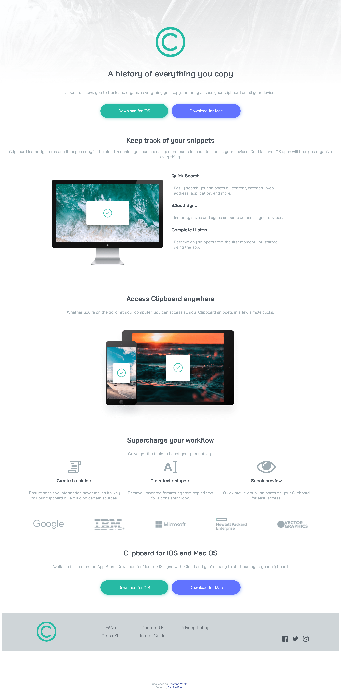

# Frontend Mentor - Clipboard landing page solution

This is a solution to the [Clipboard landing page challenge on Frontend Mentor](https://www.frontendmentor.io/challenges/clipboard-landing-page-5cc9bccd6c4c91111378ecb9). Frontend Mentor challenges help you improve your coding skills by building realistic projects. 

## Table of contents

- [Overview](#overview)
  - [The challenge](#the-challenge)
  - [Screenshot](#screenshot)
  - [Links](#links)
- [My process](#my-process)
  - [Built with](#built-with)
  - [What I learned](#what-i-learned)
  - [Continued development](#continued-development)
  - [Useful resources](#useful-resources)
- [Author](#author)

## Overview

### The challenge

Users should be able to:

- View the optimal layout for the site depending on their device's screen size
- See hover states for all interactive elements on the page

### Solution Screenshot

[Mobile screenshot](images/mobile-screenshot.png)

### Links

- Solution URL: [Solution at github](https://github.com/fyrfli/clipboard-landing-page)
- Live Site URL: [See it live](https://github.io/fyrfli/clipboard-landing-page)

## My process

This time around, I started with mobile first styling and got it perfect. It was when I switched to desktop styling that I started running into issues. I think that I need more practice with this process before I get it right. The solution **looks** presentable, but there are overflows everywhere. I am going to submit this for help and hopefully be able to sort it out afterwards.

### Built with

- Semantic HTML5 markup
- CSS custom properties
- Flexbox
- CSS Grid
- Mobile-first workflow
- [VSCode](https://code.visualstudio.com)
- [Firefox](https://www.mozilla.org/en-US/firefox/new/) -- specifically using the built-in developer tools.

### What I learned

I need far more practice building websites like this one because while I think I have the theoretical process down, I need more practice making smoother and less confusing -- both for me and for those who may read my code.

### Continued development

I am going to submit this project as is (as I noted above) and hopefully get some good feedback on what I could do better. In the meantime, I am going to try this again and see if I can do it better ... maybe even include some basic Javascript.

### Useful resources

- [CSS Tricks](https://css-tricks.com/) - This website is truly a valuable resource. I don't think I would be able to complete these challenges as easily without it.
- [Mozilla Developer Network](https://developer.mozilla.org/en-US/) - The ultimate reference and resource for HTML and CSS for me and I will certainly make full use of it for Javascript too.

## Author

- Website - [Camille Frantz](https://github.com/fyrfli)
- Frontend Mentor - [@fyrfli](https://www.frontendmentor.io/profile/fyrfli)
- Twitter - [@fyrfli](https://www.twitter.com/fyrfli)
