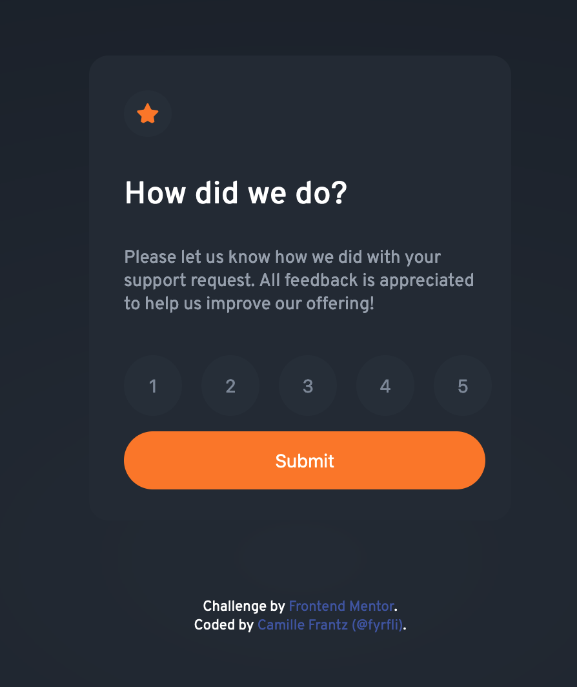

# Frontend Mentor - Interactive rating component solution

[fyrfli's](https://github.com/fyrfli) solution to the [Interactive rating component challenge on Frontend Mentor](https://www.frontendmentor.io/challenges/interactive-rating-component-koxpeBUmI). Frontend Mentor challenges help you improve your coding skills by building realistic projects. 

## The challenge

Users should be able to:

- View the optimal layout for the app depending on their device's screen size
- See hover states for all interactive elements on the page
- Select and submit a number rating
- See the "Thank you" card state after submitting a rating

## Screenshot

## Links

- Solution URL: [Code](https://github.com/fyrfli/frontendmentor-challenges/tree/master/interactive-rating-component)
- Live Site URL: [Live](hhttps://fyrfli.github.io/frontendmentor-challenges/interactive-rating-component)

## My process

I had the HTML and CSS done weeks ago but then realised my JS knowledge was rudimentary, at best. So I took a couple of weeks off to understand JS more profoundly. Even then, I needed some help (i.e. I had to search for other similar solutions) to get the button listener working properly. And then I had some issues with the style switches in JS because VSCode has event.PreventDefault() labelled as "deprecated" (at least the "event" bit) and so I had to do a little more reading and experimentation. Finally, I got it working in a way I am happy with. And here it is.

### Built with

- Semantic HTML5 markup
- CSS custom properties
- Mobile-first workflow
- Vanille Javascript

### What I learned

I still have yet to learn some frameworks, but I take such pleasure in watching something I am building take form line by line, bit by bit that I am hesitant to do so. I know at some point, if I intend to get certain types of jobs, I will have to start learning but I am having so much fun as is that I am sticking to vanilla code for now.

All that said, I realised with this project that my foundational programming skills are pretty solid still and all I need now is practice, practice, practice!!!

### Useful resources

I used SO many resources this time around, let's see if I can remember to add them all: 

- [MDN](https://developer.mozilla.org), as usual, was a solid resource.
- [javascript.info](https://javascript.info/) started me off perfectly with getting down and dirty with Javascript.
- [Eloquent Javascript](https://eloquentjavascript.net/) was a godsend - it helped me understand that I am not dense or slow, I just was tackling the approach to Javascript all wrong.

I think that's about it for now.

## Author

- Website - [Camille Frantz (@fyrfli)](https://fyrfli.io)
- Frontend Mentor - [@fyrfli](https://www.frontendmentor.io/profile/fyrfli)
- Twitter - [@fyrfli](https://www.twitter.com/fyrfli)
