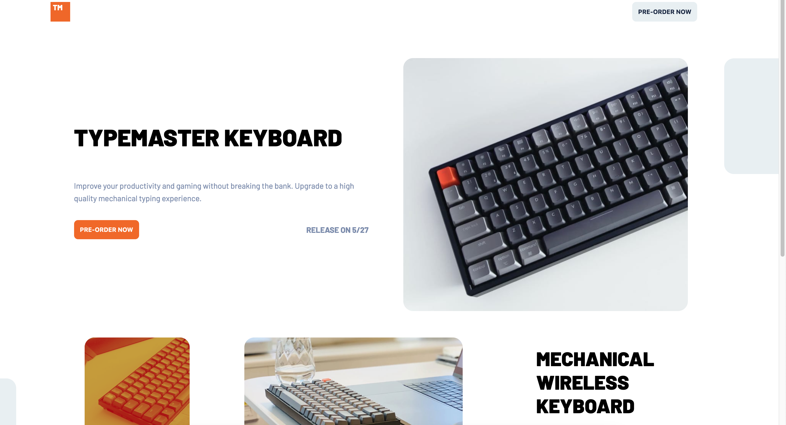

# Frontend Mentor - Typemaster pre-launch landing page solution

[@fyrfli](https://www.frontendmentor.io/profile/fyrfli)'s solution to the [Typemaster pre-launch landing page challenge on Frontend Mentor](). Frontend Mentor challenges help you improve your coding skills by building realistic projects.

### Screenshot

### Links

- Solution URL: [Code](https://github.com/fyrfli/frontendmentor-challenges/tree/master/typemaster-pre-launch-landing-page)
- Live Site URL: [Add live site URL here](https://fyrfli.github.io/frontendmentor-challenges/typemaster-pre-launch-landing-page/)

## Built with

- Semantic HTML5 markup
- CSS custom properties
- Flexbox
- Mobile-first workflow
- [LessCSS](https://lesscss.org)

## Author

- Website - [Camille Frantz (@fyrfli)](https://fyrfli.io)
- Frontend Mentor - [@fyrfli](https://www.frontendmentor.io/profile/fyrfli)
- Twitter - [@fyrfli](https://www.twitter.com/fyrfli)